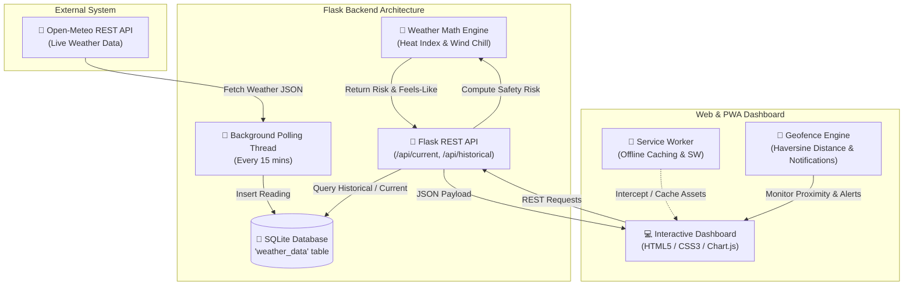

# Wireless Weather Station & Predictor 🌦️

A full-stack, real-time Wireless Weather Station and Health Safety Analytics web application built with **Flask**, **SQLite**, **JavaScript (ES6+)**, **Chart.js**, and **Progressive Web App (PWA)** technology.

The system automatically fetches live atmospheric weather data (temperature, humidity, wind speed, precipitation) from external meteorology services, computes dynamic health and outdoor activity safety indices (Heat Index & Wind Chill), stores time-series data locally in SQLite, and serves an interactive web dashboard equipped with live historical charts, Progressive Web App offline capabilities, and location-based geofence alerts.

---

## 🌟 Key Features

- 🛰️ **Automated Background Weather Polling**: Runs an asynchronous daemon thread in Flask to fetch current weather data every 15 minutes via the Open-Meteo API.
- 💾 **Local SQLite Time-Series Database**: Automatically initializes and persists atmospheric metrics into a structured SQLite database (`weather.db`).
- 🩺 **Dynamic Health & Safety Index**: Calculates feels-like temperatures using the **Rothfusz Heat Index regression** and **Wind Chill equations** to issue outdoor safety recommendations and risk assessments (Low Risk, Moderate, High Risk, Extreme Danger, Freezing).
- 📊 **Interactive Weather Dashboard**: Displays real-time metric cards (Temperature, Humidity, Wind Speed, Rainfall) along with interactive line charts powered by **Chart.js** for today's and yesterday's historical trends.
- 📱 **Progressive Web App (PWA)**: Includes a Service Worker (`sw.js`) and web app manifest (`manifest.json`) enabling offline availability, caching, and installability on mobile/desktop devices.
- 📍 **Geofence & Location Alerts**: Features a client-side Geofencing module using the **Haversine formula** to measure proximity to the weather station and issue browser Notifications for extreme weather conditions.

---

## 🛠️ Tech Stack

### **Backend & Data Pipeline**
- **Language**: Python 3.x
- **Web Framework**: Flask 3.0+
- **Database**: SQLite 3 (`sqlite3` standard library)
- **External API**: Open-Meteo Meteorological Forecast REST API
- **Concurrency**: Python `threading` for background daemon polling

### **Frontend & User Interface**
- **Core**: HTML5, Vanilla CSS3 (Custom Glassmorphism styling), JavaScript (ES6+)
- **Data Visualization**: Chart.js
- **PWA Features**: Service Worker API, Web App Manifest
- **Device APIs**: Geolocation API, Web Notifications API

---

## 🔄 Workflow Architecture Diagram



---

## 🔌 API Endpoints Reference

| Endpoint | Method | Parameters | Description |
| :--- | :--- | :--- | :--- |
| `/` | `GET` | None | Serves the main single-page web dashboard (`index.html`). |
| `/api/current` | `GET` | None | Returns the latest weather reading along with computed health/activity safety indices. |
| `/api/health_index` | `GET` | `temp_f`, `humidity`, `wind_speed` | Computes feels-like temperature and safety advisory on demand. |
| `/api/historical` | `GET` | `duration` (`today` / `yesterday`) | Returns historical time-series weather readings for chart rendering. |

---

## 🚀 Getting Started

### Prerequisites
- **Python 3.8+** installed on your system.

### Installation & Setup

1. **Clone the Repository**
   ```bash
   git clone https://github.com/anushka009-lab/Weather-Predictor-.git
   cd "wireless weather station"
   ```

2. **Set up Virtual Environment**
   ```bash
   # On Windows
   python -m venv venv
   .\venv\Scripts\activate
   ```

3. **Install Dependencies**
   ```bash
   pip install -r requirements.txt
   ```

4. **Run the Application**
   - **Using Python directly**:
     ```bash
     python main.py
     ```
   - **Or using the Windows Batch launcher**:
     Double-click `START_SERVER.bat` or run:
     ```cmd
     START_SERVER.bat
     ```

5. **Open Dashboard**
   Navigate to `http://127.0.0.1:8000` in your web browser.

---

## 📂 Project Structure

```
wireless weather station/
├── main.py              # Main Flask server entry point & daemon polling thread
├── database.py          # SQLite database connection & CRUD operations
├── weather_math.py      # Health index, Heat Index (Rothfusz), & Wind Chill logic
├── seed.py              # Mock data generator for testing
├── requirements.txt     # Python dependencies
├── START_SERVER.bat     # One-click Windows startup script
├── static/
│   ├── index.html       # Single-page app layout
│   ├── styles.css       # Custom glassmorphism UI styles
│   ├── app.js           # Dashboard logic, API fetching, & Chart.js integration
│   ├── geofence.js      # Haversine distance calculator & notification trigger
│   ├── sw.js            # PWA Service Worker for offline caching
│   └── manifest.json    # Web App Manifest
├── .gitignore           # Git ignore file
└── README.md            # Project documentation
```

---

## 📄 License

This project is open source and available under the [MIT License](LICENSE).
